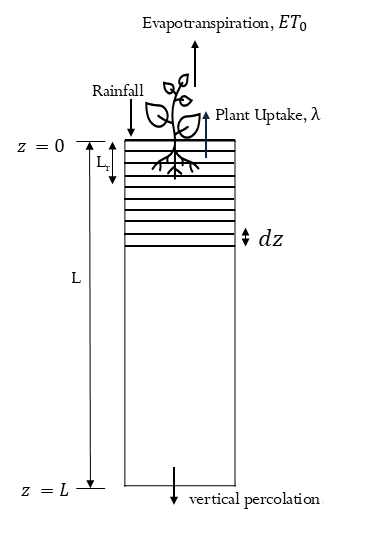
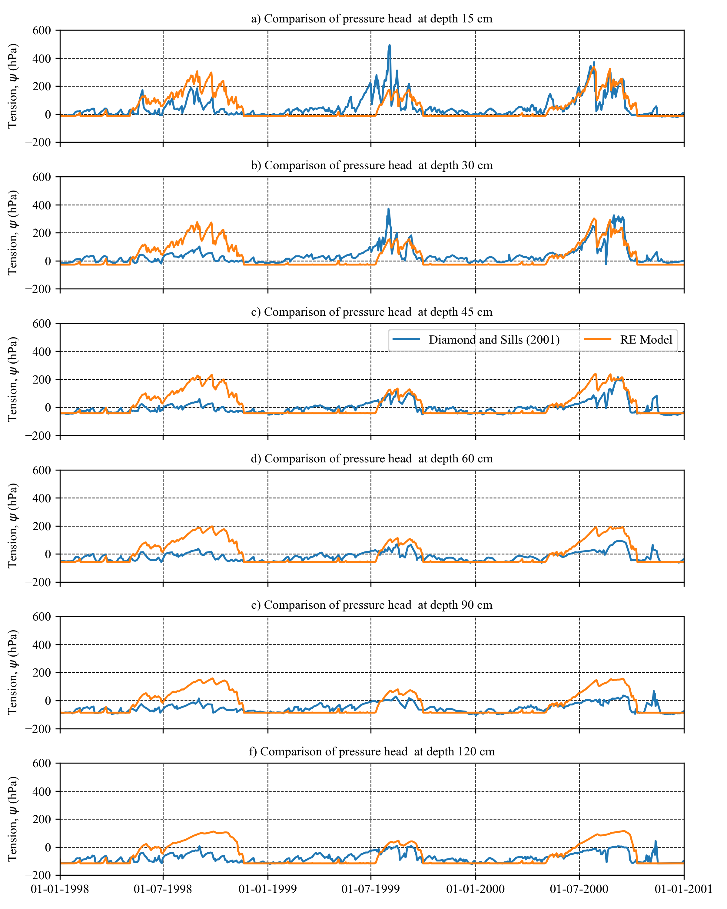
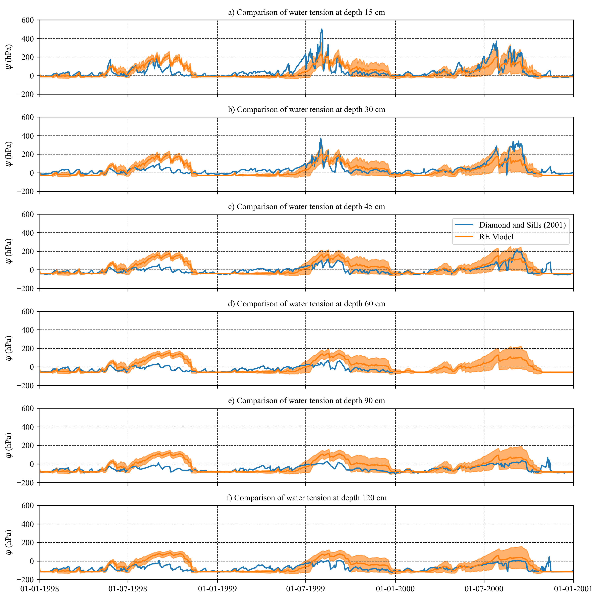

# 1D_RE_Model_MonteCarlo
A Python-Based Numerical Implementation of the 1D Richards Equation (RE) with Root Water Uptake
### Author
Saurabh Kumar
PostDoctoral Research Fellow,
School of Mathematics and Statistics,
Univeristy Institute Dublin,  

### Project Description: 
This repository contains a one-dimensional Richards Equation (RE) based numerical model for simulating transient unsaturated water flow in grassland soils.
* Basic Theory and code analysis is documented in pdf document
* Code allows for various boundary conditions including options for ponding at the top boundary, and at bottom boundary zero flow or free drainage boundary condition can be applied.
* Here, the z = 0 is at top or surface and and z=L is the bottom.
* 1D RE Model Base Model contains base 1D RE model
* 1D RE Model Monte Carlo Framework contains 1D RE model with Monte Carlo framework

### Plot of Model Outputs for 1D RE Model Base Model

### Plot of Model Outputs for 1D RE Model Monte Carlo Framework

